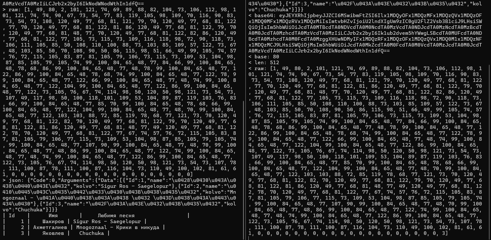
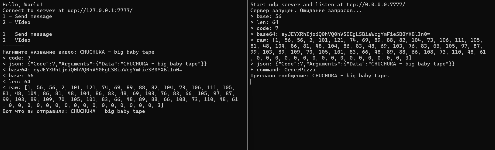

# Lab5.Network Application

### Основные файлы
- **`UserApiClient.cs`** - реализация TCP клиента для управления пользователями.
- **`MessageApiClient.cs`** - реализация UDP клиента для отправки сообщений.
- **`MessageUdpServer.cs`** - реализация сервера для обработки UDP команд.
- **`Program.cs`** - точка входа в приложение.

## Установка и запуск

### Требования
- .NET 6.0 или выше.
- Visual Studio 2022 или любая другая IDE, поддерживающая .NET.

### Установка
1. Клонируйте репозиторий:
2. Откройте проект в Visual Studio 2022.
3. Постройте решение (`Build Solution`).

### Запуск
1. Запустите сервер:
   - Перейдите в проект с сервером (например, `Lab5.Network.Server`).
   - Выполните запуск сервера.
2. Запустите клиент:
   - Перейдите в проект с клиентом (например, `Lab5.Network.Client`).
   - Выполните запуск клиента.

## Работа программы

