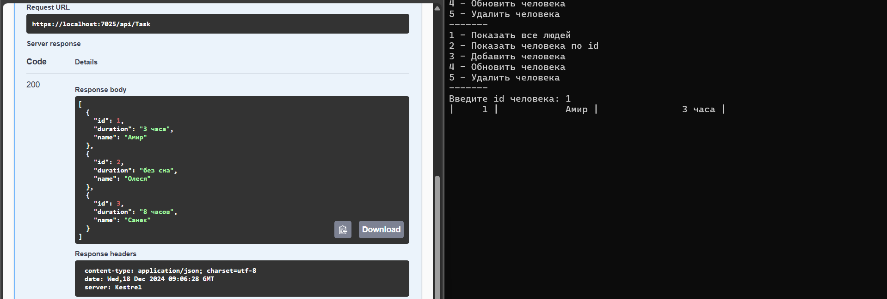

HTTP и JSON являются важными компонентами веб-технологий, обеспечивающими передачу данных между клиентами и серверами.

## Что такое HTTP?

**HTTP (Hypertext Transfer Protocol)** — это протокол передачи данных, который используется для обмена информацией в интернете. Он определяет правила, по которым клиенты (например, веб-браузеры) и серверы взаимодействуют друг с другом. Основные характеристики HTTP включают:

- **Запросы и ответы**: Клиент отправляет запрос на сервер, а сервер отвечает с необходимыми данными. Запросы могут быть различных типов, включая GET (для получения данных) и POST (для отправки данных на сервер).
- **Статус-коды**: Сервер возвращает статус-коды, которые информируют клиента о результате выполнения запроса (например, 200 для успешного выполнения, 404 для не найденного ресурса).
- **Безопасность**: Для безопасной передачи данных используется расширение HTTPS, которое шифрует данные между клиентом и сервером.

HTTP является основой для работы веб-приложений и API, позволяя пользователям взаимодействовать с различными ресурсами в интернете.

## Что такое JSON?

**JSON (JavaScript Object Notation)** — это текстовый формат для представления структурированных данных. Он разработан на основе синтаксиса объектов JavaScript, но может использоваться независимо от него в различных языках программирования. Основные аспекты JSON включают:

- **Структура данных**: Данные в JSON представлены в виде пар "ключ-значение", что делает их легко читаемыми как для человека, так и для машины. JSON поддерживает различные типы данных, включая строки, числа, массивы и объекты.
- **Применение**: JSON широко используется в веб-разработке для обмена данными между клиентом и сервером. Например, при запросе информации о товаре на сайте интернет-магазина сервер может вернуть данные в формате JSON.
- **Преимущества**: JSON легче и быстрее по сравнению с другими форматами обмена данными, такими как XML. Он позволяет осуществлять асинхронные запросы без необходимости обновления страницы, что улучшает производительность веб-приложений.

JSON стал стандартом для передачи данных в интернете благодаря своей простоте и эффективности.

### Работа программы

